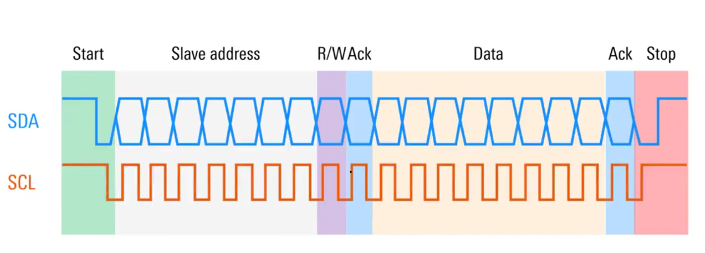
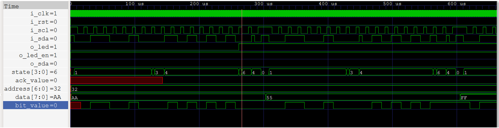

# i2c_led

**Difficulty:** Beginner

**Uses MCU:** Yes

**External Hardware:** None

## Overview

This example demonstrates controlling an LED on the FPGA using I2C communication from the MCU. You will learn how to implement a simple I2C slave interface in FPGA and use it to control hardware outputs using byte-level commands.

## Compatibility

| Board                | Firmware                | Status        |
| -------------------- | ----------------------- | ------------- |
| Shrike-Lite (RP2040) | `firmware/micropython/` | ✅ Tested      |


## Hardware Setup

No external hardware required.

### I2C Configuration

* SDA → GPIO0
* SCL → GPIO1
* Frequency → 100 kHz
* Slave Address → `0x32`

### Control Signal

* Reset Pin → GPIO3 (Active Low)

> Reset must be HIGH for normal operation.

## Quick Start (Pre-Built Bitstream)

1. Connect your Shrike board via USB
2. Upload `bitstream/i2c_led.bin` using ShrikeFlash
3. Run the MicroPython script
4. In the console, type:

   * `on` → LED turns ON
   * `off` → LED turns OFF

## Build From Source

### FPGA (Verilog)

1. Open `i2c_led.ffpga` in Go Configure Software Hub
2. Click **Synthesize → Generate Bitstream**
3. Output will be in `ffpga/build/`

### Firmware 

1. Open the script in Thonny
2. Select MicroPython (RP2040) interpreter
3. Run the script

## How It Works

The FPGA implements an I2C slave that listens on address `0x32`. When the MCU sends a byte, the FPGA decodes the value and updates the LED state accordingly.

The MicroPython firmware:

* Initializes I2C on GPIO0 (SDA) and GPIO1 (SCL)
* Sends command bytes to the FPGA
* Uses a reset pin to control FPGA reset state

### Command Protocol

* `0xAA` → LED ON
* `0xFF` → LED OFF

### Firmware Snippet

```python id="q1x8pl"
from machine import Pin, I2C
import time

reset = Pin(3, Pin.OUT)
reset.high()

i2c = I2C(0, scl=Pin(1), sda=Pin(0), freq=100_000)
SLAVE_ADDR = 0x32  

def write_byte(addr, value):
    i2c.writeto(addr, bytes([value]))
```

## Expected Output

Console interaction:

```text id="7v0m3r"
Enter command (on/off):
```

* Typing `on` → sends `0xAA` → LED turns ON
* Typing `off` → sends `0xFF` → LED turns OFF

Console output:

```text id="m3c9dj"
Sent 0xAA (LED ON)
Sent 0xFF (LED OFF)
```

The LED responds immediately to I2C commands.

## I2C protocol reference



Protocol diagram source: Rohde & Schwarz, [R&S RTM User Manual, Figure 11-4: I2C write access with 7-bit address](https://scdn.rohde-schwarz.com/ur/pws/dl_downloads/dl_common_library/dl_manuals/dl_user_manual/RTM_UserManual_en.pdf). The diagram illustrates the I²C transaction structure; the project waveform below shows this design's signals.

## Project waveform



This is the project waveform image for this example. It shows the address and data stimulus, the slave's low ACK level, the state progression, and the LED response. The cursor shows address `0x32`, data `0xAA`, and `ack_value=0` (ACK).

The full testbench trace is available as [`output/i2c_tb.vcd`](output/i2c_tb.vcd). A separately rendered view of the first write transaction is available as [`output/i2c_simulation_waveform.png`](output/i2c_simulation_waveform.png); regenerate it with [`output/render_i2c_waveform.py`](output/render_i2c_waveform.py). The simulation uses [`ffpga/sim/tb_top.vt`](ffpga/sim/tb_top.vt) and `ffpga/src/top`.

The existing testbench simulation passed its valid-address LED checks for `0xAA`, `0x55`, `0xFF`, and `0xAA` again. It also received NACKs for the wrong address (`0x18`) and confirmed that the LED stayed on. These checks are reported by the testbench in the simulator console.
