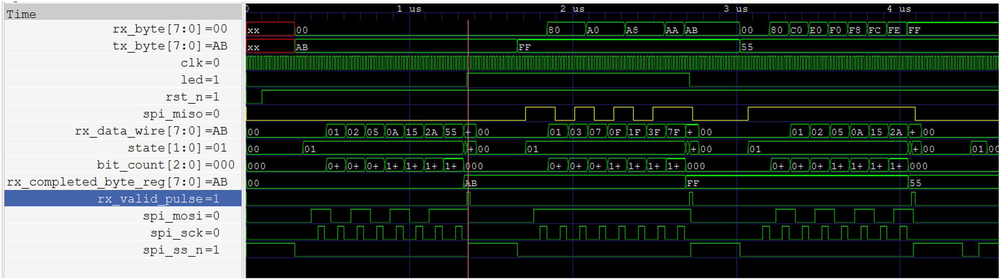
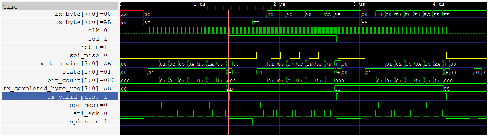

# spi_loopback_led

**Difficulty:** Intermediate

**Uses MCU:** Yes

**External Hardware:** None

## Overview

This example demonstrates controlling the onboard LED on Shrike using SPI commands from the RP2040 (or any SPI master). It also implements a loopback mechanism where data sent from the MCU to the FPGA is returned back to the MCU.

You will learn how to implement an SPI target (slave) in FPGA and perform bidirectional communication using SPI.

## Compatibility

| Board                | Firmware                | Status        |
| -------------------- | ----------------------- | ------------- |
| Shrike-Lite (RP2040) | `firmware/micropython/` |       -       |

## Hardware Setup

No external hardware required.

### FPGA Connections

| FPGA GPIO Pin | Signal Name | Direction | Description              |
| ------------- | ----------- | --------- | ------------------------ |
| 3             | `spi_sck`   | Input     | SPI clock                |
| 4             | `spi_ss_n`  | Input     | Chip select (active low) |
| 5             | `spi_mosi`  | Input     | MOSI (receive)           |
| 6             | `spi_miso`  | Output    | MISO (transmit)          |
| 18            | `rst_n`     | Input     | Reset (active low)       |
| 16            | `led`       | Output    | LED state                |

### RP2040 Connections

| RP2040 Pin | Signal Name | Direction | Description               |
| ---------- | ----------- | --------- | ------------------------- |
| 2          | SCK         | Output    | SPI clock                 |
| 1          | CS          | Output    | Chip select               |
| 3          | MOSI        | Output    | Master output             |
| 0          | MISO        | Input     | Master input              |
| 14         | Reset       | Output    | Reset signal (active low) |

### ESP32 S3 Connections

| ESP32 Pin | Signal Name | Direction | Description               |
| ---------- | ----------- | --------- | ------------------------- |
| 12          | SCK         | Output    | SPI clock                 |
| 10          | CS          | Output    | Chip select               |
| 11          | MOSI        | Output    | Master output             |
| 13          | MISO        | Input     | Master input              |
| 14         | Reset       | Output    | Reset signal (active low) |

> Ensure pin mapping in FPGA constraints matches firmware configuration.

---

## Quick Start (Pre-Built Bitstream)

1. Connect Shrike board via USB
2. Upload `bitstream/spi_loopback_led.bin` using ShrikeFlash
3. Run `spi_led.py` on RP2040
4. Expected result:

   * Sending `0xAB` → LED turns ON
   * Sending `0xFF` → LED turns OFF
   * Data sent is looped back to MCU

---

## Build From Source

### FPGA (Verilog)

1. Open project in Go Configure Software Hub
2. Paste Verilog for `top` and `spi_target` modules
3. Configure I/O mapping
4. Generate bitstream

### Firmware (MicroPython)

1. Open `spi_led.py` in Thonny
2. Configure SPI pins
3. Run script to send/receive data

---

## How It Works

The design consists of two main modules:

### 1. `top` Module

* Controls LED based on received SPI data
* Implements loopback functionality
* Instantiates SPI target module

Behavior:

* `0xAB` → LED ON
* `0xFF` → LED OFF
* Transmits previously received byte back via SPI

---

### 2. `spi_target` Module

* Implements SPI slave (target) logic
* Handles:

  * Data reception via MOSI
  * Data transmission via MISO
  * Clock synchronization using `spi_sck`
  * Chip select handling using `spi_ss_n`

---

## Top Module Interface

| Signal     | Direction | Description                   |
| ---------- | --------- | ----------------------------- |
| `clk`      | In        | System clock (50 MHz typical) |
| `clk_en`   | Out       | Clock enable (always 1)       |
| `rst_n`    | In        | Reset (active low)            |
| `led`      | Out       | LED output                    |
| `spi_ss_n` | In        | SPI select (active low)       |
| `spi_sck`  | In        | SPI clock                     |
| `spi_mosi` | In        | Input from controller         |
| `spi_miso` | Out       | Output to controller          |

---

## Expected Output

* Sending `0xAB` → LED turns ON
* Sending `0xFF` → LED turns OFF
* Data sent from RP2040 is echoed back (loopback)

This confirms:

* SPI communication is working
* FPGA correctly processes and returns data

---

## Notes

* SPI operates in full-duplex mode (simultaneous read/write)
* Loopback helps verify communication integrity
* Ensure correct reset handling before communication

---

## SPI waveform comparison and debug notes

### Final capture

The final capture is the clearest one to use as the project reference. It shows the SPI pins alongside the internal receive shift register, state, bit counter, completed-byte register, `rx_valid_pulse`, and LED. The earlier capture is retained here for comparison:

Both captures show the same key sequence and agree with the RTL/testbench for SPI Mode 0 (CPOL=0, CPHA=0), 8-bit MSB-first transfers:

| MOSI command | Completed byte / valid event | Expected LED | Waveform result |
| --- | --- | --- | --- |
| `0xAB` | `rx_completed_byte_reg = AB`, one-cycle `rx_valid_pulse` | On | LED goes high |
| `0xFF` | `rx_completed_byte_reg = FF`, one-cycle `rx_valid_pulse` | Off | LED goes low |
| `0x55` | `rx_completed_byte_reg = 55`, one-cycle `rx_valid_pulse` | Unchanged | LED stays low |

The receive shift register visibly builds each byte as the SPI clock edges are sampled, and `bit_count` advances through the eight received bits before the completed-byte/valid indication. The LED changes after the completed byte is decoded. This matches the RTL's explicit use of the completed-byte register, which avoids decoding the old shift-register value on the same clock edge that receives the final bit.

### What the waveform says about debugging

The capture documents a useful signal-tracing method: observe the external bus (`spi_ss_n`, `spi_sck`, `spi_mosi`) together with internal milestones (`state`, `bit_count`, `rx_data_wire`, completed byte, valid pulse), then follow the result to `led`. That makes it possible to localize a failure to bus timing/bit order, byte assembly, valid timing, or command decode. The waveform supports that this sequence was checked this way; it cannot establish the exact steps or order in which the debugging was originally performed.

The existing `ffpga/sim/spi_tb.vt` provides the stimulus and checks reset, the three LED behaviors, and MISO output-enable behavior. It displays sampled MISO bytes but does not assert an expected loopback byte, so this waveform alone should not be treated as a complete proof of echo correctness.
