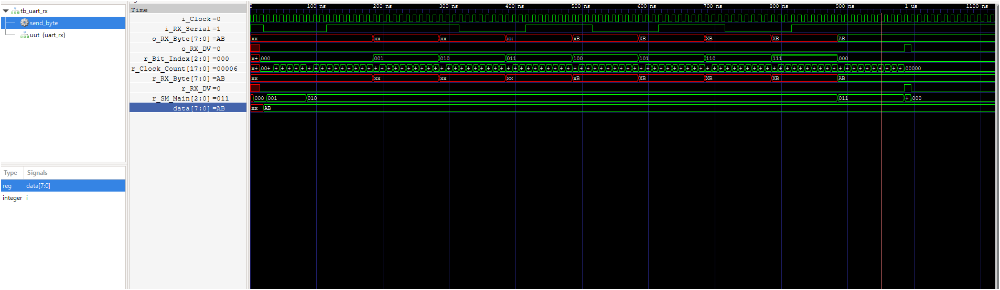
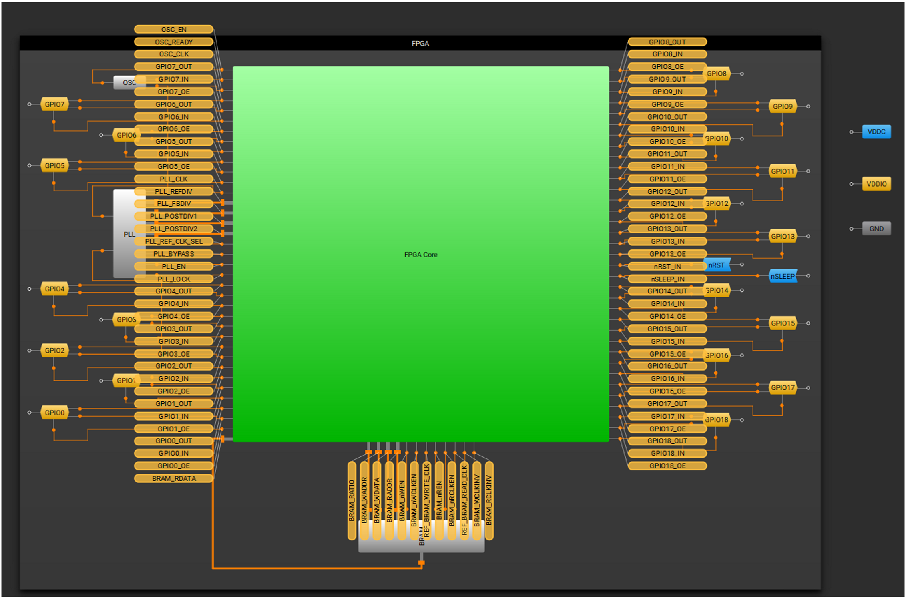
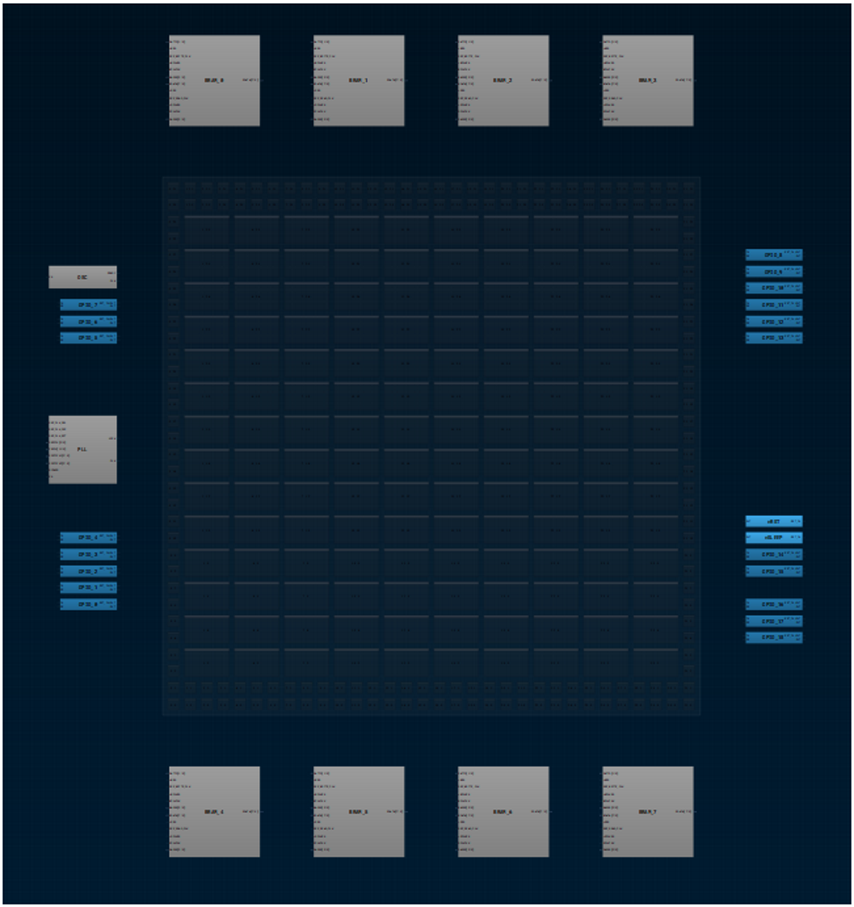

# UART LED example

This project receives an 8-N-1 UART stream and controls the LED from the received byte:

- `0xAB` turns the LED on.
- `0xFF` turns the LED off.
- Other bytes leave the LED state unchanged.

## UART receive waveform

The waveform below shows the receiver sampling a byte sent least significant bit first. The serial input is idle high, goes low for the start bit, carries `0xAB`, and returns high for the stop bit. The receiver assembles `0xAB` and asserts `o_RX_DV` when the byte is complete.

The waveform image is in [`output/waveform_top.png`](output/waveform_top.png). The receiver testbench is [`ffpga/sim/tb_uart_rx.vt`](ffpga/sim/tb_uart_rx.vt); the board-level LED testbench is [`ffpga/sim/tb_top_tb.vt`](ffpga/sim/tb_top_tb.vt).

## FPGA layout references

These attached images are visual references for the FPGA pinout and floorplan:

